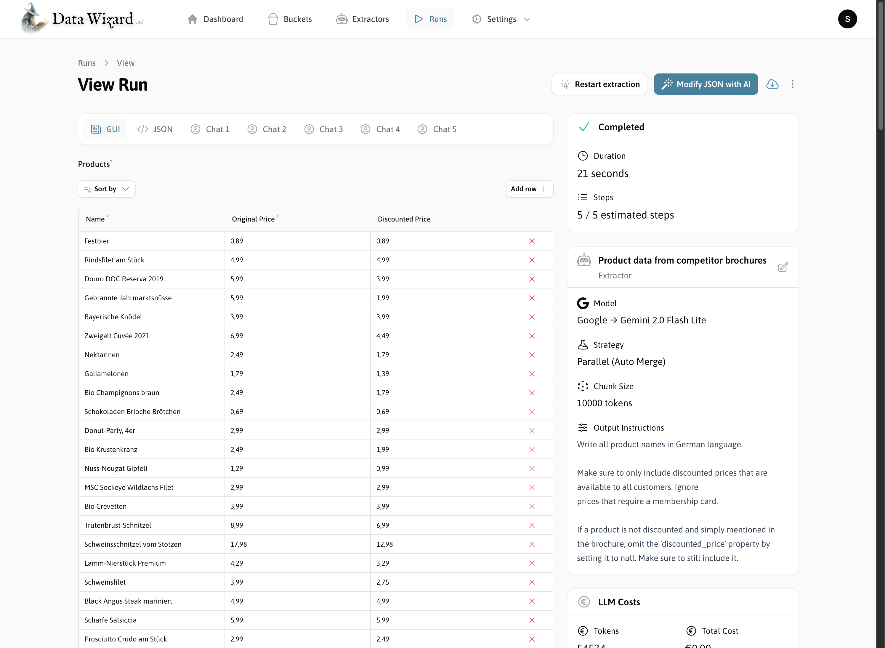
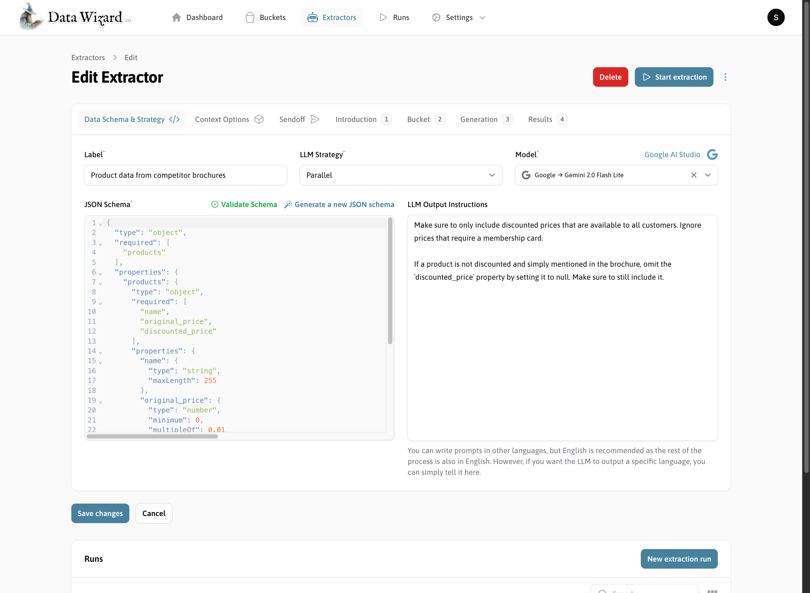
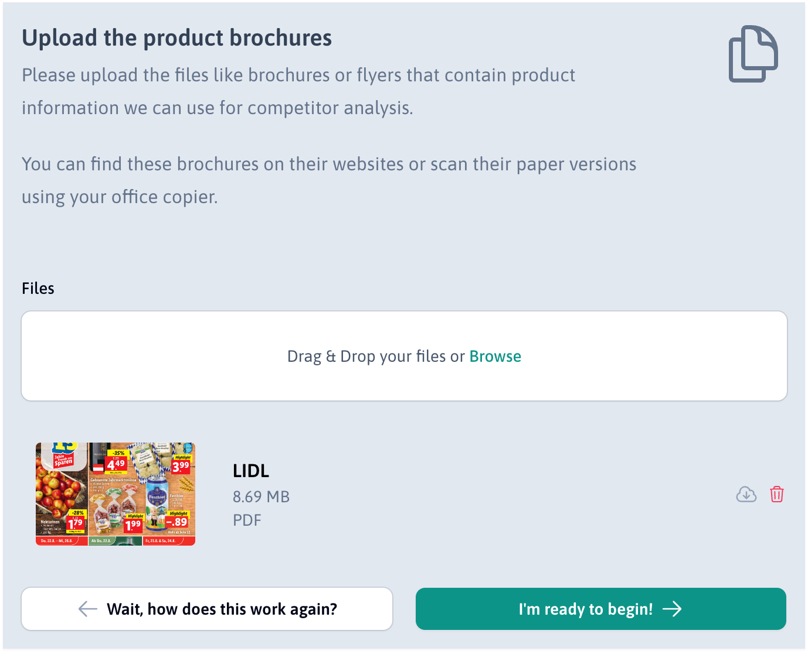
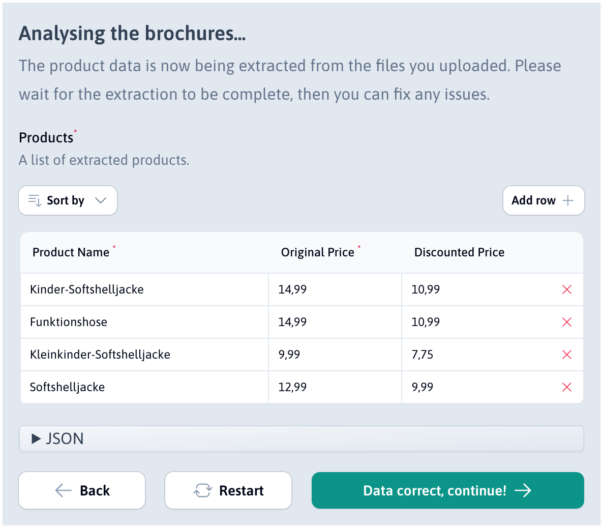
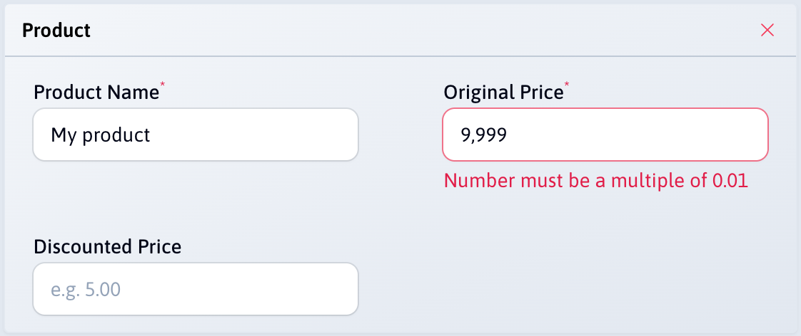
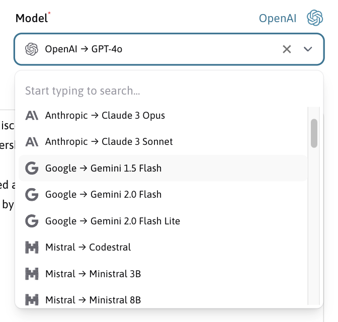
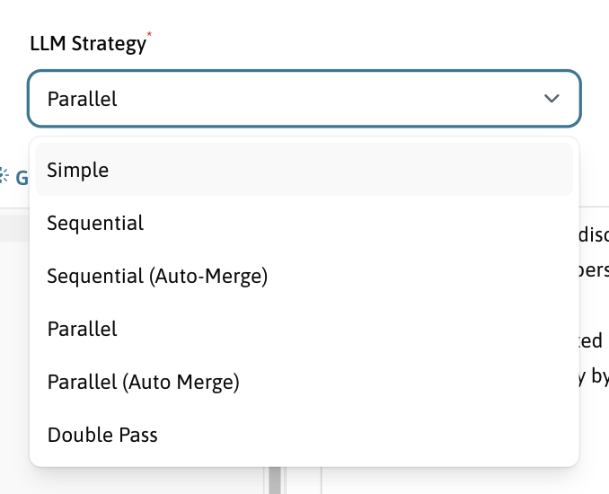

<div align="center">

<br>

<h1>🪄 Data Wizard</h1>
<p><strong>Extract Structured Data from Any Document with LLMs</strong></p>
<p>Data Wizard is an open-source tool designed to simplify and automate the extraction of structured data from unstructured documents like PDFs, Word files, and images using Large Language Models. Turn complex documents into validated, machine-readable JSON effortlessly.</p>

[**Quick Start Guide**](https://docs.data-wizard.ai/quick-start) | [**Documentation**](https://docs.data-wizard.ai) | [**Homepage**](https://data-wizard.ai) | [**Made by Lukas Mateffy**](https://mateffy.me)

[](https://www.gnu.org/licenses/agpl-3.0)
[](https://github.com/capevace/data-wizard)


</div>

<br>
<br>

## Key Features

* **Powerful Extraction Engine:** Define exactly the data structure you need using standard JSON Schema and Data Wizard
  will extract it from your documents.
* **LLM Agnostic:** Works with various LLMs including OpenAI (GPT-4, GPT-3.5), Anthropic (Claude), Google AI (Gemini),
  Mistral AI, local models via Ollama/LMStudio, and more through OpenRouter. Powered by [
  `mateffy/llm-magic`](https://github.com/mateffy/llm-magic).
* **Multiple Extraction Strategies:** Choose the best strategy (Simple, Sequential, Parallel, Auto-Merging, Double-Pass)
  for your document type and complexity, or create your
  own [Custom Strategy](https://docs.data-wizard.ai/custom-strategies).
* **Handles Diverse File Types:** Process PDFs (native & scanned w/ OCR), Word (DOCX), Excel (XLSX), images (PNG, JPG),
  and more.
* **Visual Context:** Utilizes embedded images and page screenshots to provide crucial visual context to the LLM,
  improving accuracy.
* **Data Validation:** Rigorously validates the LLM's output against your JSON Schema, ensuring clean, reliable, and
  immediately usable data.
* **Seamless Integration:** Embed the UI easily via iFrame with a JavaScript API, or interact programmatically using the
  comprehensive RESTful and GraphQL APIs.
* **Open Source & Self-Hostable:** Deploy easily using Docker for complete data control and privacy on your own
  infrastructure. Licensed under AGPL-3.0.

## How it Works

1. **Configure Extractor:** Define your desired output data structure
   using [JSON Schema](https://docs.data-wizard.ai/extractors), select
   an [LLM](https://docs.data-wizard.ai/configure-llm), and choose
   an [Extraction Strategy](https://docs.data-wizard.ai/strategies).
2. **Upload Documents:** Upload your files (PDFs, DOCX, images, etc.) via the UI, embedded iFrame, or programmatically
   via the [API](https://docs.data-wizard.ai/api). Files are pre-processed to extract text and images.
3. **Get Structured Data:** The chosen strategy directs the LLM interaction. The AI extracts the data, which is then
   validated against your schema. Receive clean JSON via the UI, webhook, or API.

## Example Use Cases

* **Automate Data Entry:** Extract data from invoices, receipts, and forms into ERP/accounting systems.
* **SaaS Smart Import:** Allow users to upload documents to populate data in your CRM, SaaS app, etc.
* **Document Conversion:** Turn batches of PDFs or scans into structured JSON/CSV.
* **Core Extraction Engine:** Power your own document processing platform using Data Wizard's API.
* **Market Research:** Gather product/pricing data from competitor materials.
* **Compliance Checks:** Extract specific clauses or data points from contracts or reports.

## Usage / Getting Started

The easiest way to use Data Wizard is to use the pre-built Docker container.

**1. Generate `APP_KEY`:**
Before running, generate a secure application key:

```bash
openssl rand -base64 32
```

Copy the generated key.

**2. Run Docker Container:**

* **Using `docker run`:**

  ```bash
  docker run \
    --name data-wizard \
    -p 9090:80 \
    -p 4430:443 \
    -p 4430:443/udp \
    -v data_wizard_storage:/app/storage \
    -v data_wizard_sqlite_data:/app/database \
    -v data_wizard_caddy_data:/data \
    -v data_wizard_caddy_config:/config \
    -e APP_KEY=<REPLACE_WITH_GENERATED_APP_KEY> \
    mateffy/data-wizard:latest
  ```
  *(Remember to replace `<REPLACE_WITH_GENERATED_APP_KEY>`)*

* **Using `docker-compose`:**
  Create a `docker-compose.yml` file:
  ```yaml
  version: '3.8'

  services:
    data-wizard:
      container_name: data-wizard # Optional: Define a specific container name
      image: mateffy/data-wizard:latest
      ports:
        - "9090:80"
        - "4430:443"
        - "4430:443/udp"
      volumes:
        - data_wizard_storage:/app/storage
        - data_wizard_sqlite_data:/app/database
        - data_wizard_caddy_data:/data
        - data_wizard_caddy_config:/config
      environment:
        - APP_KEY=<REPLACE_WITH_GENERATED_APP_KEY> # Replace with your generated key

  volumes:
    data_wizard_storage:
    data_wizard_sqlite_data:
    data_wizard_caddy_data:
    data_wizard_caddy_config:
  ```
  Then run: `docker-compose up -d`

**3. Access Data Wizard:**
You can then access the application at `https://localhost:4430`. You may need to accept a self-signed certificate
warning in your browser for local access.

➡️ For more details, see the [**Quick Start Guide**](https://docs.data-wizard.ai/quick-start) and [**Deployment
Documentation**](https://docs.data-wizard.ai/deployment).

## Requirements for Manual Installation

Data Wizard is a Laravel application, so you'll need everything that Laravel requires in order to run.
Most databases should work, but SQLite and Postgres have been tested.

DataWizard uses [`mateffy/llm-magic`](https://github.com/mateffy/llm-magic) for LLM interaction and file data
extraction.

In order for file extraction to work you'll need to have [`uv`](https://github.com/astral-sh/uv) installed on your
machine and in your PATH.
You can also configure custom paths to use in the `llm-magic.php` config file. For more on this see
the [llm-magic documentation](https://github.com/mateffy/llm-magic).

While `llm-magic` uses a custom Python script to extract text and images from PDFs, [
`Blaspsoft/doxswap`](https://github.com/Blaspsoft/doxswap) is used for converting Word and other rich text documents to
PDF beforehand.
`doxswap` requires that LibreOffice is installed on your machine. You may need to set the `LIBRE_OFFICE_PATH`
environment variable to the path of the `soffice` executable.

## Thesis

This project was made as part of my 2025 BSc thesis at [Leuphana University Lüneburg](https://leuphana.de). The thesis
is available [here](https://github.com/capevace/bachelor-thesis-submission).

## Screenshots

|                                                                                                                                                                                                                                         |  |
|-----------------------------------------------------------------------------------------------------------------------------------------------------------------------------------------------------------------------------------------|-------------|
|  <br> The standalone UI allows you to run extraction tasks manually, which also helps evaluating and debugging your extractor.                                                          |  <br> Create reusable extractors for different documents. The built-in extractor editor allows you to define the JSON Schema, configure extra instructions & the context window, as well as the extraction strategy. |
|  <br> Users can upload files via the UI. The files are pre-processed in the background, with the text and any embedded images being extracted from the PDF or Word file. |  <br> Easily embed Data Wizard in your app. Users can upload documents, edit JSON, and view results in a user-friendly interface. |
|  <br> The JSON output is validated against the JSON Schema, including rules like `minLength` or `multipleOf`.                                                             |  <br> Data Wizard is not limited to a single LLM provider. You can choose from a variety of LLMs, including GPT-4, Claude and Gemini. |
|  <br> Choose from a variety of extraction strategies, including simple, sequential, parallel and auto-merging.                                                                |

## Copyright and License

This project is made by [Lukas Mateffy](https://mateffy.me) and is licensed under
the [GNU Affero General Public License v3.0 (AGPL-3.0)](https://choosealicense.com/licenses/agpl-3.0/).

## Contributing

At the moment, this project is not open for contributions.
However, if you have ideas, bugs or suggestions, feel free to open an issue or start a discussion!
